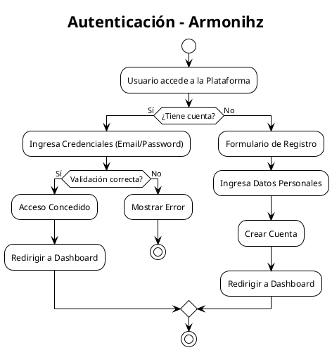
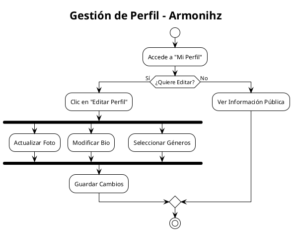
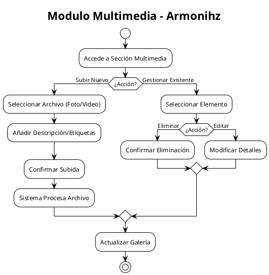
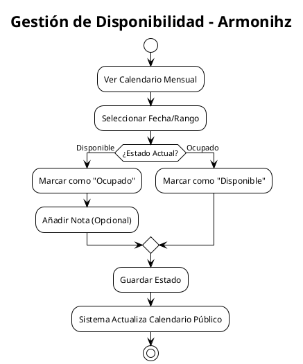
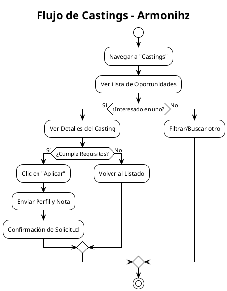
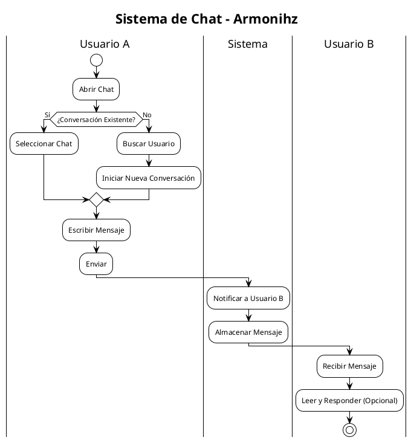
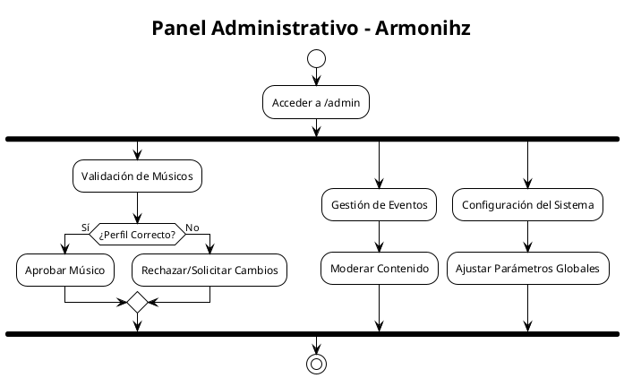

# Diagramas UML por Vista - Armonihz Web

Aquí tienes los diagramas UML detallados y separados por módulos/vistas para mayor claridad. Puedes usar estos códigos en cualquier herramienta compatible con PlantUML o Mermaid.

## 1. Autenticación (Login/Registro)
**Vista:** `auth.login`, `auth.register`
**Descripción:** Flujo de entrada de usuarios a la plataforma.

## 2. Perfil del Músico
**Vista:** `profile`
**Descripción:** Visualización y edición de la información del músico.

## 3. Multimedia (Portafolio)
**Vista:** `multimedia`
**Descripción:** Gestión de fotos y videos del músico.

## 4. Disponibilidad (Calendario)
**Vista:** `availability`
**Descripción:** Configuración de fechas libres u ocupadas.

## 5. Castings (Oportunidades)
**Vista:** `castings.index`, `castings.show`
**Descripción:** El músico busca y aplica a ofertas.

## 6. Chat (Mensajería)
**Vista:** `chat`
**Descripción:** Comunicación directa entre usuarios.

## 7. Panel de Administración
**Vista:** `admin.*`
**Descripción:** Funciones exclusivas del administrador.

